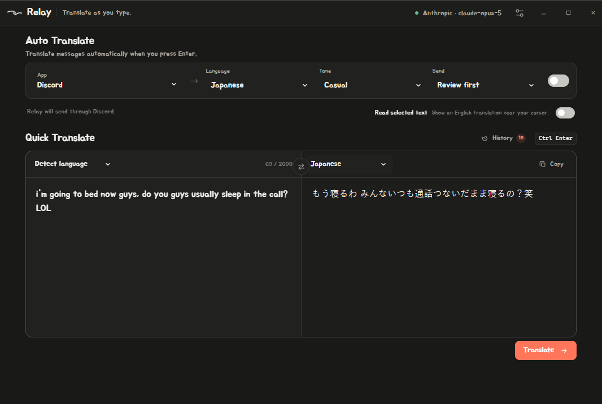

<h1>Relay</h1>

Type in English, send in Korean, Japanese or French — without it turning your
message into a customer service email.

Sits in the Windows tray and works in the apps you choose.



## What it does

**Auto translate.** Pick a language, then type and press Enter like normal. Your
message goes out translated

**Selected text popup.** Turn it on, highlight someone's message, and the English
pops up next to your cursor for a few seconds. No shortcut needed

**Quick translate.** Two panes in the app for checking something before you send
it.

**Local history.** Reuse or copy recent translations from the app. It stays on
your computer and can be turned off or cleared whenever you want.

Auto Translate only runs in allowed apps. Relay pauses itself in password fields,
payment and sign-in pages, terminals, and password managers.

Right-click the tray icon to toggle Auto Translate, change language, check the
target app, translate selected text, or open Relay.

The point is that it keeps how you actually write. Lowercase, no periods,
swearing, however much you use "lol" — and the right level of formality for each
language. 반말 not 해요체, タメ口 not です・ます, tu not vous.

## Install

Grab one from [releases](https://github.com/qdmezzy/relay/releases):

| | |
|---|---|
| `Relay-Setup-*.exe` | Installer. Shortcuts, uninstall entry, updates itself. |
| `Relay-*-portable.exe` | Just run it. Tells you when there's a new version, but you download it yourself. |

You also need [Ollama](https://ollama.com/download) and the model:

```
ollama pull translategemma:4b
```

Relay tells you if either one is missing.


## Free or paid

Ollama is the default and it's free. Runs on your GPU, nothing leaves the
machine, and Relay drops the model out of VRAM when you close it.

If you want it sharper, paste an Anthropic key on the Engine page instead — a
few dollars a month at normal use. The key is saved on your machine and never
shown again once you save it.

## Running from source

Needs Node 26, AutoHotkey v2 and Ollama.

```
npm install
npm start
```

That starts the translation service and the hotkey helper on its own.

## Building

```
npm run build
```

Both builds land in `dist`. `npm test` covers the pipeline and the app's own
flows; `npm run test:release` checks the packaged service actually boots.

Publishing a version needs `gh auth login`:

```
npm version patch
npm run release
```
